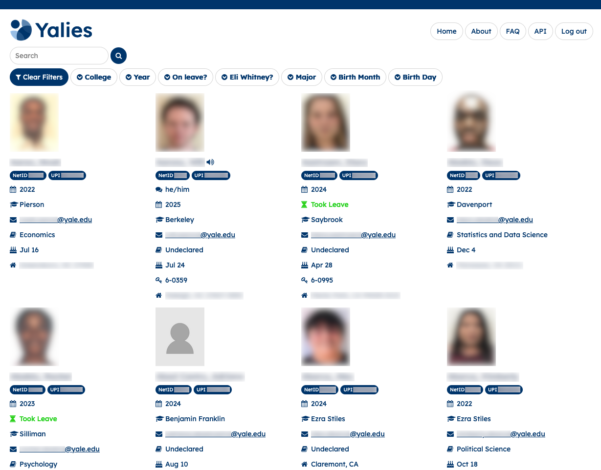

# [👥 Yalies](https://yalies.io)

> A website and API for getting information on students at Yale College.



## Setup
To develop changes to the application, you'll need to run it locally for testing.

This guide assumes, as prerequisites, that you have:
* A MacOS or Linux-based OS (if you use Windows, you can still follow along, but some commands may be different)
* Access to, and basic understanding of, the terminal on your computer
* Python 3
    * Modern MacOS versions and most Linux distributions include Python 3 by default.
    * If you use a version of MacOS with only Python 2, first [install Homebrew](https://brew.sh/#install), a helpful package manager for MacOS, then use it to install Python 3:
    ```sh
    brew install python3
    ```

Once all prerequisites are installed, clone this repository to your machine from your terminal:
```sh
git clone https://github.com/Yalies/api
```

Then, enter the directory:
```sh
cd api
```

Install dependencies:
```sh
pip3 install -r requirements.txt
pip3 install -r requirements-test.txt
```

If `pip3` is not recognized, you'll need to install Python 3 on your system.

Finally, run the database migrations:
```sh
python3 -m flask db upgrade
```

## Running
To locally launch the application:
```sh
FLASK_APP=app.py FLASK_ENV=development flask run
```
The app will subsequently be available at [localhost:5000](http://localhost:5000).

When running locally, the app will use a non-hosted SQLite database, meaning that all database contents will be stored in `app.db`. If you wish to run SQL queries on this database, simply install sqlite (best obtained through Homebrew or other package manager), and run:
```sh
sqlite3 app.db
```

## Scraper
Our scraper crawls Yale's websites in order to obtain the data we provide. See documentation [here](app/scraper/README.md).

## License
[MIT](LICENSE)

## Author
[Erik Boesen](https://github.com/ErikBoesen)
